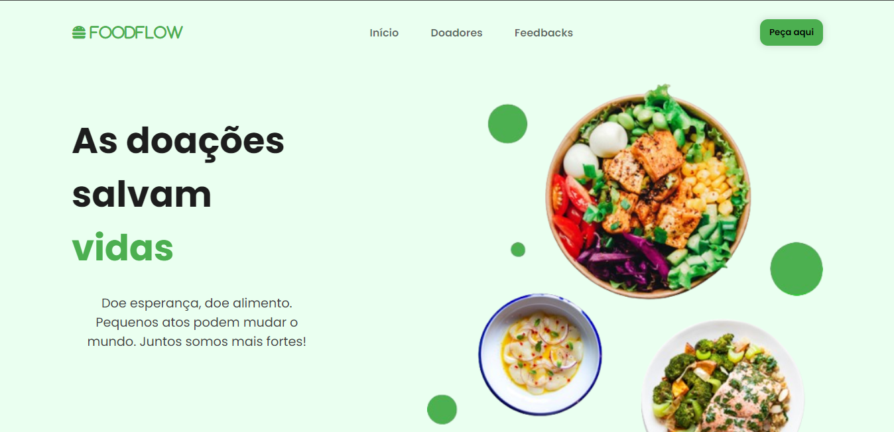

# Welcome to the FOODFLOW 🍔

## Introduction

My application, called FoodFlow, is an innovative platform that connects food donors with people in need. The goal of FoodFlow is to fight food waste and promote solidarity by facilitating the donation of surplus food from supermarkets, restaurants, and agricultural producers to individuals and institutions in need.

The application uses a real API, integrated with a database, to ensure that the information about donors, recipients, and donations is efficiently and securely managed. This allows real-time donation tracking, connecting those who want to help with those who need assistance, while monitoring the entire process in an organized and transparent way.

It's important to note that the site is still under development, which means that many features are still being implemented, and new improvements are being worked on to make the platform even more complete and efficient in the future.

This project was developed as part of Module 5 of the FullStack training at Instituto Programadores do Ajante.

Link to the api used: https://github.com/andreirce/api-foodflow


## Technologies used💻

* ReactJS
* Axios
* API REST
* Vercel Deploy *developing*


## Configurations🔧

### Prerequisites
* Node.js installed
* npm (Node Package Manager) or yarn

### Instalation
1. Clone the repo
```bash
https://github.com/andreirce/foodflow.git
```

2. Install dependencies
```bash
npm install
```
3. To start the development server, use:
```bash
npm run dev
```


# Credits
* Design credits to Larissa Kich
* The design was inspired by Larissa's project, but with implementations of my technologies and resources
